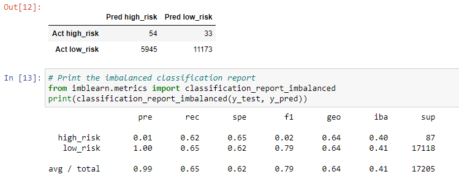
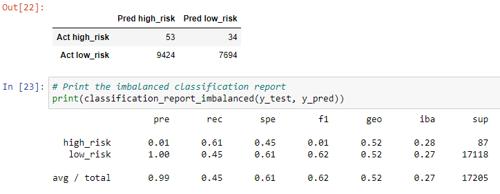
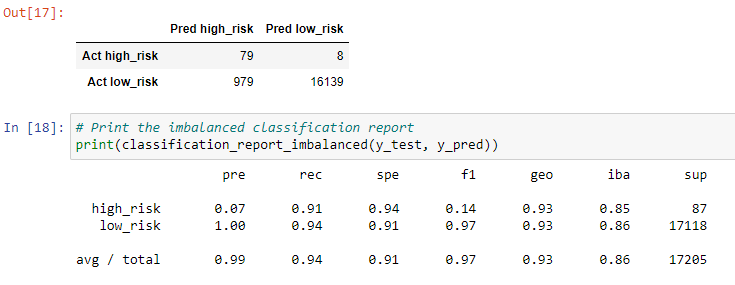

# Credit_Risk_Analysis

## Overview

Using data preparation, statistical reasoning, and machine learning, we solve a real-world challenge: credit card risk.

Credit risk is an inherently unbalanced classification problem, as good loans easily outnumber risky loans. Therefore, we’ll need to employ different techniques to train and evaluate models with unbalanced classes. We use imbalanced-learn and scikit-learn libraries to build and evaluate models using resampling.

Using the credit card credit dataset from LendingClub, a peer-to-peer lending services company, we oversample the data using the RandomOverSampler and SMOTE algorithms, and undersample the data using the ClusterCentroids algorithm. Then, we use a combinatorial approach of over- and undersampling using the SMOTEENN algorithm. Next, we compare two new machine learning models that reduce bias, BalancedRandomForestClassifier and EasyEnsembleClassifier, to predict credit risk. Once done, we evaluate the performance of all these models and make a recommendation on whether they should be used to predict credit risk.

## Executive Summary of Results:

- All models showed greater than 0.61 recall score in predicting high risk credit applications.

- Yet, no single model gave high confidence when predicting high risk credit applications.

- Easy Ensemble AdaBoost Classifier had the highest recall with 0.91 in predicting high risk credit applications.

## Naive Random Oversampling

Model Accuracy = 0.6366972052004142

## SMOTE Oversampling

Model Accuracy = 0.6302712208564487

## Undersampling

Model Accuracy = 0.5293318990697431

## Combination (Over and Under) Sampling

Model Accuracy = 0.6375533316412246

## Balanced Random Forest Classifier

Model Accuracy = 0.7877672625306695

## Easy Ensemble AdaBoost Classifier

Model Accuracy = 0.925427358175101

## Summary and Recommendations

With a 0.925 accuracy and a 0.91 recall score, the **Easy Ensemble AdaBoost Classifier** produced the best result when predicting high risk credit applications.

Given the features used to classify each group of potential loans, the summary dataframes and individual model testing above show that both **Easy Ensemble AdaBoost** and **Random Forest Classifiers** seems to have outperformed the Resampling techniques in accurately predicting high-risk credit card applicants vs. ones with low-risk. However, in the case of screening for high-risk individuals, high sensitivity outweighs the precision performance of the model, meaning: it is better to minimize false negatives and let those few with a high-risk slip through the test, than to upset many more applicants who are at low risk. In the grand scheme of things, it may be better to make a few high-risk loans, than to needlessly annoy many more low-risk applicants to protect the overall reputation of the organization underwriting the loans.
